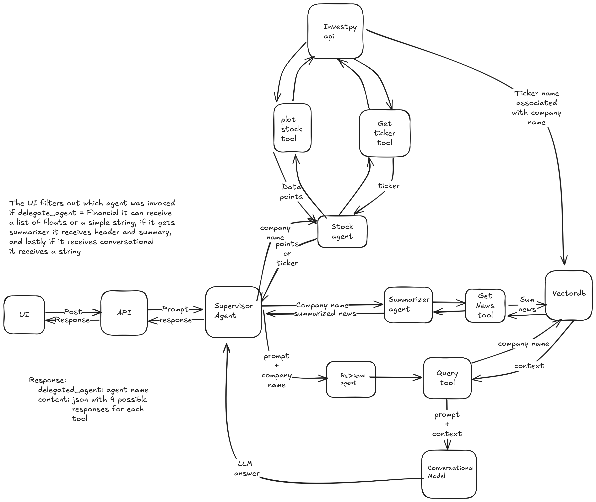

# Ibovespa stock agent

TODO: Adjust the import paths

Multiagent architecture that rewrites the user input for the desired agent interpreted by the supervisor agent, the supervisor agent
supervises 3 agents:

- Finance agent: This agent gets the input and searches for the ticker and adds to the vectorial db or returns the datapoints to plot
- Summarizer agent: This agent searches the web for news related to company and stores for retrieval purposes
- Conversational agent: This agent calls the text2text-generator giving context from the vectordb about the company that the user prompted 

## Architecture

TODO: Insert the architecture image

UI -> prompt -> API -> Supervisor -> [Finance, Summarizer, Conversational] -> API -> UI

## Stack used

TODO: Explain the stack used

Pydantic_ai, Logfire, Streamlit, Chromadb, Fastapi, HuggingFace[Transformers]
